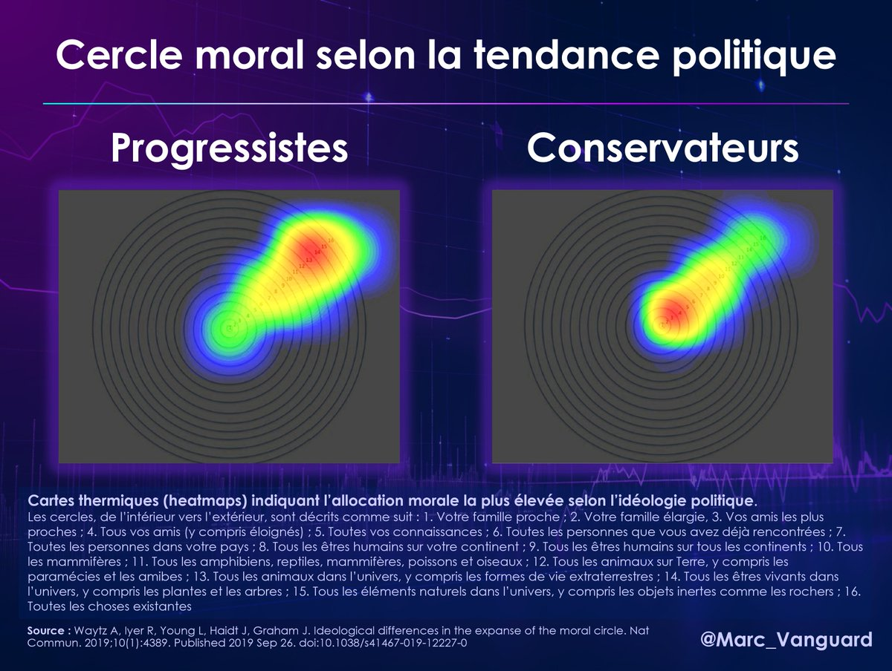
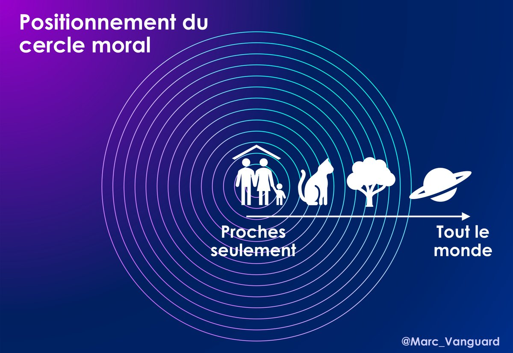

# Le cercle moral

### Le cercle moral correspond à l’ampleur des personnes ou concepts auxquels les individus accordent de l’importance ou de l’empathie. Les conservateurs tendent à avoir un cercle moral plus restreint et les progressiste un cercle moral plus large.

**Le concept du cercle moral est l’étude de la façon dont les individus considèrent leur priorité morale en fonction de leur idéologie politique. Alors que les progressistes incluent tout le monde dans leur empathie, les conservateurs privilégient leurs proches et leur nation.**

Dans une étude de 2019, des chercheurs ont demandé aux participants de dessiner l’étendue de leur cercle moral, c’est-à-dire l’ensemble des individus ou des concepts envers lesquels les relations sont guidées par des règles morales. Le cercle le plus restreint concerne la famille et les cercles les plus éloignés concernent les étrangers, l’humanité, les plantes, la planète, etc.

<figure><figcaption>
Les couleurs chaudes représentent les cercles sociaux vers lesquels l'empathie des personnes interrogées se porte le plus fortement.
</figcaption></figure>

**Les individus conservateurs manifestent un plus grand parochialisme (attachement à la paroisse, c’est-à-dire à la proximité), tandis que les individus progressistes sont plus universalistes.**

Cette répartition n’est pas homogène au sein de la population : les jeunes ont tendance à être plus universalistes que les personnes âgées, les femmes que les hommes et les urbains que les ruraux.

Au sein des pays développés, les athées sont nettement plus universalistes que les croyants, mais, à l’échelle mondiale, les pays chrétiens sont plus universalistes que les autres.

**L’universalisme n’a pas non plus la même portée selon les pays.** En Chine, il s’étend jusqu’aux compatriotes (donc à des inconnus), mais en Europe, il va souvent jusqu’aux étrangers. En Occident, l’universalisme est donc logiquement corrélé à une attitude politique favorable à l’immigration.

**L’universalisme affiché et un cercle moral élargi peuvent aussi constituer des attitudes dans le but d’afficher ce qui est perçu comme des valeurs morales associées à certaines catégories sociales.** Le progressisme est ainsi associé à ce que l’auteur américain Rob Henderson appelle des « croyances de luxe » : des opinions adoptées non pas pour leur véracité, mais pour le statut social ou intellectuel qu’elles confèrent.

**Le cercle moral élargi des progressistes, qui se confond avec l’adhésion à des&#x20;**_**croyances de luxe**_**, pose donc un problème démocratique et intellectuel**, puisqu’il se traduit en choix politiques qui ne sont pas motivés par le bien de la cité, mais par le prestige personnel qui peut en être retiré. C’est le cas, par exemple, de l’immigration « humanitaire », qui est soutenue par la gauche, mais qui est facteur de déséquilibre pour le pays, tout en étant bien trop massive pour pouvoir être accueillie dans des conditions matérielles et sociales satisfaisantes. Imposer des quotas de réfugiés, qui serait une réponse logique à la crise actuelle, est une proposition qui reçoit une opposition de principe, irraisonnée, parce qu’il est socialement valorisant d’afficher un universalisme sans limite.

**La posture conservatrice, au contraire, en privilégiant une solidarité plus forte envers les cercles restreints allant de la famille à la nation, favorisent la stabilité et la cohésion sociales.** Ce sont des valeurs qui allient une justification morale forte et légitime (l’homme est un individu limité, inscrit dans des réseaux et une sociabilité limités, sa responsabilité ne saurait ni ne pourrait donc être universelle) avec une approche de bon sens et pérenne de la politique, évitant les déséquilibres sociaux et ethniques d’une société.

<figure><figcaption></figcaption></figure>

En conclusion, la théorie du cercle moral montre des différences de sensibilité entre conservateurs et politiques qui finissent par avoir des impacts tragiques sur les sociétés et les systèmes politiques. La situation européenne de conflits ethniques, religieux et anthropologiques dus à l’immigration de masse est notamment une conséquence de l’universalisme des progressistes qui a été imposé à l’ensemble de la société.

Liens :

* [Fil twitter de Marc Vanguard présentant le concept de cercle moral](https://x.com/marc_vanguard/status/1902043557688406194)
* [Article scientifique sur le cercle moral](https://www.nature.com/articles/s41467-019-12227-0#citeas). Waytz, A., Iyer, R., Young, L. _et al._ Ideological differences in the expanse of the moral circle. _Nat Commun_ 10, 4389 (2019).
