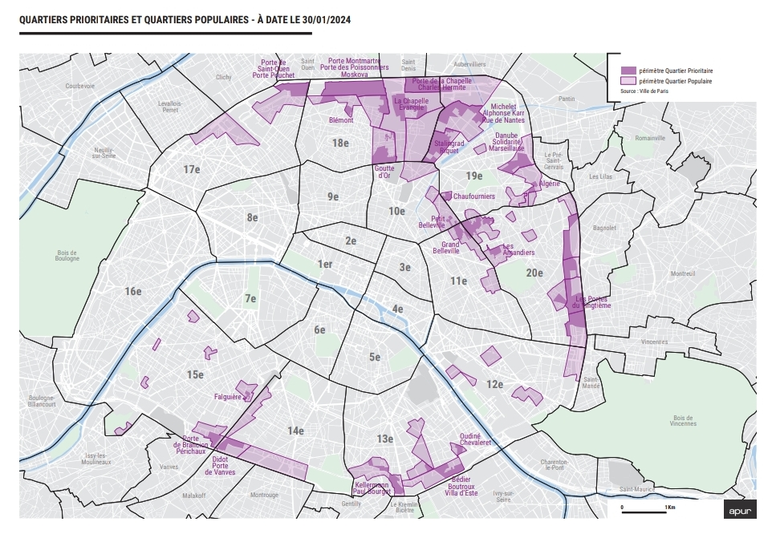

# Le mythe de "l'enclavement" des quartiers sensibles

### L’argument de « l’enclavement » géographique des quartiers sensibles qui serait la cause de leur échec est un lieu commun de gauche. Il ne correspond cependant à la réalité de quartiers situés dans les grandes agglomérations françaises, bien desservis en transports en commun et bien pourvus en services. L’usage de ce terme vise à masquer des causes sociales, culturelles et comportementales et vise à dédouaner les habitants de leur responsabilité.

**La gauche prétend que les quartiers dits sensibles seraient « enclavés »** – c’est-à-dire isolés physiquement, coupés du reste de la ville, et seraient donc des « ghettos » urbains. Selon elle, cet isolement serait la cause des problèmes sociaux et économiques que l'on y constate. Il s’agit cependant d’un discours idéologique qui ne correspond pas à la réalité.

**Des quartiers situés dans les zones métropolitaines françaises**

A l’échelle nationale, la grande majorité de ces quartiers sont situés dans les agglomérations et sur le territoire des métropoles françaises. **Ils sont ainsi localisés dans les zones les plus riches, dynamiques, dotées en services et pourvoyeuses d’emplois du pays.** Les zones rurales ou des petites villes, celles de la « France périphérique », sont bien plus éloignées de ces avantages.

<figure><figcaption>
Les quartiers prioritaires de la ville (QPV) sont situés dans les villes et métropoles françaises. 
</figcaption></figure>

**Une bonne desserte en transports**

**Les quartiers sensibles des grandes villes françaises disposent généralement d'un réseau dense et efficace de transports en commun.** En Île-de-France, 94 % des habitants des quartiers prioritaires de la ville vivent à moins de 800 mètres d’un arrêt de transport en commun (source : ONPV, 2020).

**Des investissements massifs sont consacrés à la desserte de ces quartiers.** Le Grand Paris Express, projet emblématique comprenant 200 km de nouvelles lignes de métro et 68 gares supplémentaires, est spécifiquement conçu pour améliorer la mobilité des habitants des QPV, avec un investissement total estimé à plus de 38 milliards d’euros. Les quartiers emblématiques de Clichy-sous-Bois et Montfermeil ont bénéficié de la prolongation du Tramway T4, un investissement dépassant les 300 millions d’euros. À Toulouse, le quartier de Bagatelle (un taux de chômage près de trois fois supérieur à la moyenne nationale selon l'INSEE) est relié directement au centre-ville par la ligne A du métro depuis 1993, rendant ainsi les opportunités économiques et sociales accessibles.

**Ainsi, dans bien des cas, ces quartiers sont mieux connectés aux réseaux de transports en commun que les zones résidentielles et pavillonnaires des agglomérations françaises, où les habitants dépendent bien plus de la voiture.**

En conséquence, les habitants de ces quartiers disposent d’une bonne mobilité : selon l’INSEE, plus de 70 % des actifs vivant en QPV travaillent en dehors de leur quartier.

&#x20;

**Un très bon niveau d’équipement**

Les quartiers populaires bénéficient d'un nombre considérable d’équipements publics. Selon l’Observatoire national de la politique de la ville, **ces quartiers concentrent environ 25 % des équipements sportifs et culturels des grandes métropoles françaises, alors qu'ils ne représentent que 8 % de la population totale.**

**Ces équipements sont abondamment financés par l’argent public**, par exemple par le biais de programme nationaux comme celui de la Rénovation urbaine. Ainsi, à Lyon, le quartier de la Duchère a bénéficié en 2021 de la rénovation d'un complexe sportif pour un coût total de 45 millions d’euros. À Marseille, le projet Euroméditerranée visant spécifiquement les quartiers nord a mobilisé près de 7 milliards d’euros depuis son lancement, permettant une modernisation significative des infrastructures locales.

&#x20;

**Il y a aussi des quartiers de centre-ville**

Un certain nombre des quartiers prioritaires de la ville présentant des caractéristiques sociales et économiques similaires aux quartiers « enclavés » de banlieue sont en réalité situés dans des zones centrales des agglomérations françaises. C’est le cas par exemple à Paris, commune-centre d’une agglomération de 12 millions d’habitants, qui compte 20 QPV.

<figure><figcaption>
Paris compte 20 QPV
</figcaption></figure>

En conclusion, **les quartiers sensibles ne souffrent pas d’un enclavement territorial**. Ils ne sont pas nécessairement plus éloignés du centre que d’autres quartiers résidentiels, ils sont bien pourvus en services et bien connectés au reste des agglomérations. **Leur « enclavement » territorial est bien un mythe.**
